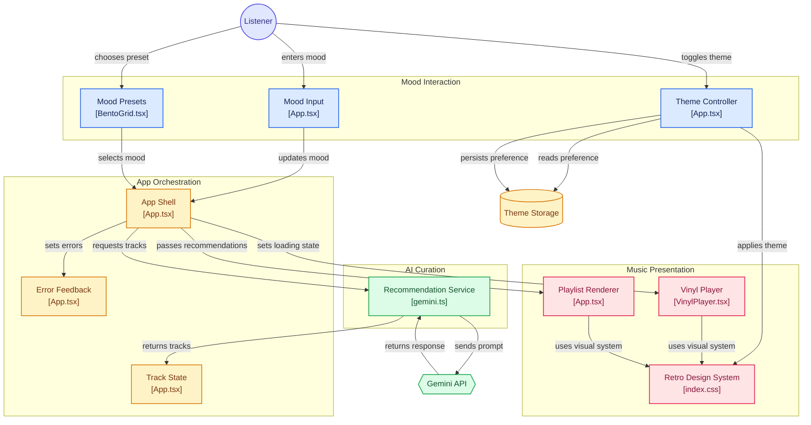

# 🎶 The Mood Machine: AI-Powered Music Recommender

An interactive, retro-editorial web application that generates highly curated song recommendations based on a user's exact state of mind. Built with React and powered by the Google Gemini API.

## ✨ Features

- **AI-Powered Curation**: Uses advanced prompt engineering to instruct the Gemini API to act as a master DJ, returning structured JSON tracklists rather than raw text.
- **Retro Editorial Interface**: A bespoke design system utilizing custom Tailwind CSS v4 variables, brutalist shadows, and a warm vintage color palette (Playfair Display & Space Mono).
- **Vinyl Player Animations**: Smooth, Framer Motion-powered interactive vinyl record that spins dynamically while the API fetches recommendations.
- **Bento-Grid Presets**: A modern, interactive grid layout for one-click mood selection (e.g., "Late Night Drive", "Sunday Sunshine").
- **Dark Mode Support**: A seamless Light/Dark mode toggle that persists user preference using Local Storage and Tailwind CSS variables.

## 🛠️ Tech Stack

- **Framework**: React 19 + Vite
- **Styling**: Tailwind CSS v4
- **Animations**: Framer Motion
- **Icons**: Lucide React
- **AI Integration**: Google Gen AI SDK (`@google/genai`)

## 🧠 How it Works

The core of this application relies on **Prompt Engineering for Structured Output**. 
Instead of relying on a traditional music database, the app leverages the LLM's vast pre-trained knowledge. By injecting the user's mood into a strict system prompt, we force the AI to return a clean JSON array of tracks instead of conversational text. This allows the React frontend to parse and render the data programmatically.

### Architecture Workflow



## 🚀 Getting Started

To run this project locally, you will need Node.js and a Google Gemini API Key.

1. **Clone the repository:**
   ```bash
   git clone https://github.com/zeom1/mood-based-music.git
   cd mood-based-music
   ```

2. **Install dependencies:**
   ```bash
   npm install
   ```

3. **Set up Environment Variables:**
   Create a `.env` file in the root directory and add your Gemini API key:
   ```env
   VITE_GEMINI_API_KEY=your_actual_api_key_here
   ```

4. **Run the development server:**
   ```bash
   npm run dev
   ```
   Open your browser to `http://localhost:5173` to see the app in action!

## 🤝 Contributing
Feel free to fork this project, open issues, or submit PRs if you'd like to add new features or integrations!
